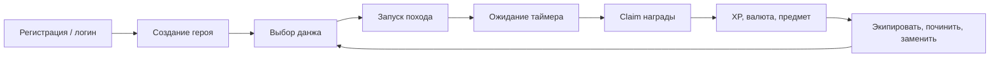
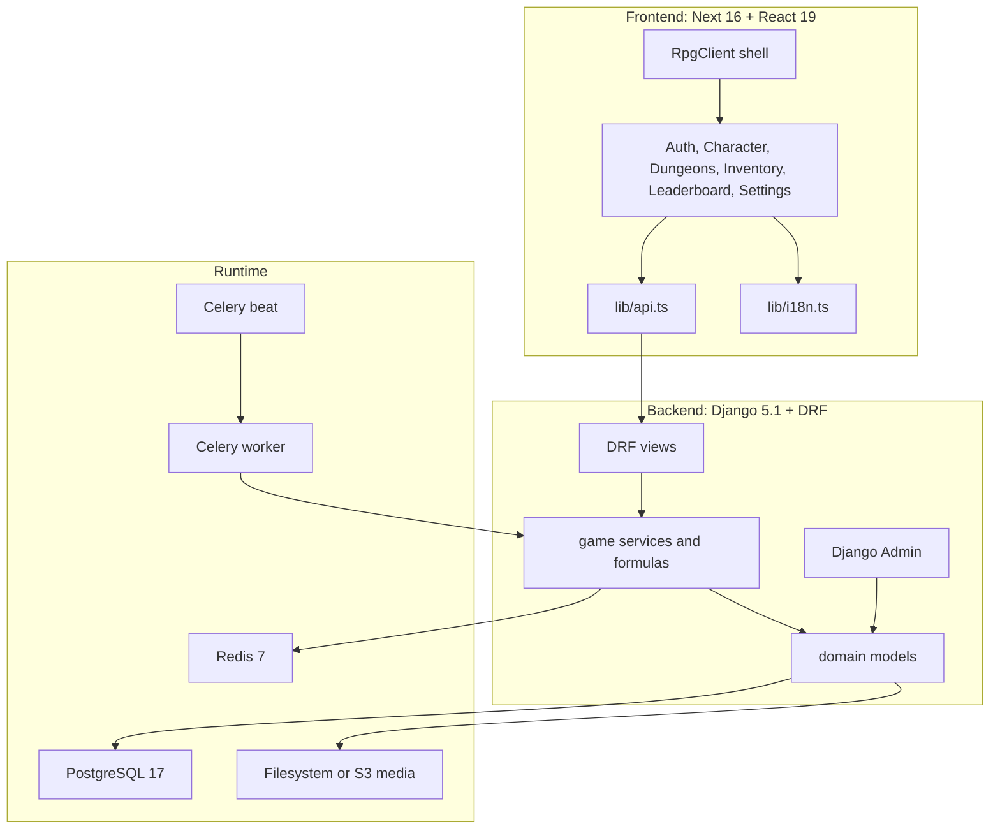
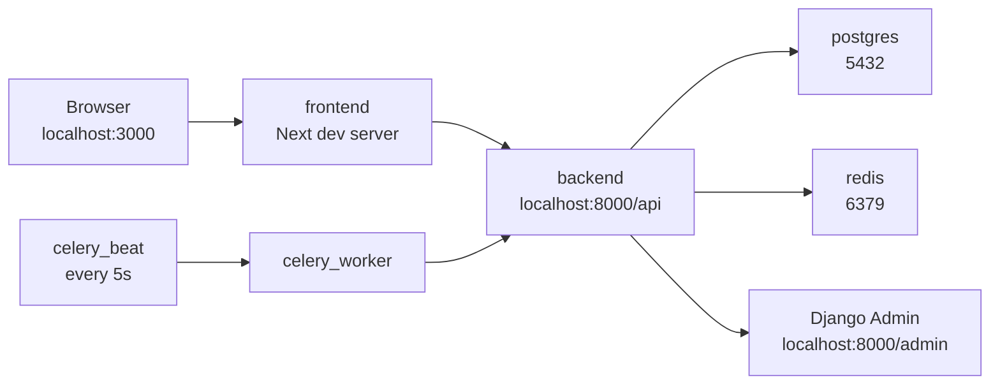
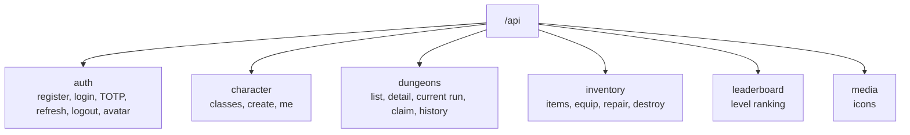
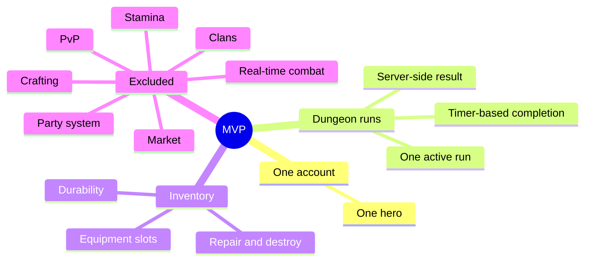

# Browser Async RPG

Браузерная idle/async RPG про одного героя, данжи по таймеру, лут, экипировку,
прочность предметов, ремонт, прогрессию и таблицу лидеров. Проект находится в
MVP-границах: сервер считает игровые результаты и экономику, а frontend дает
игроку понятный игровой интерфейс без real-time боя.

## Что уже есть

- Регистрация, логин, refresh/logout и двухфакторная защита через TOTP.
- Один аккаунт - один герой, создание героя из классов персонажей.
- Данжи, запуск похода, ожидание завершения, claim награды.
- Автоматический расчет успеха, опыта, валюты, прочности и шанса лута.
- Инвентарь, экипировка, ремонт, bulk repair/destroy preview.
- Leaderboard по уровню.
- RU/EN интерфейс, аватар из backend media assets.
- Django Admin как MVP-инструмент для администрирования и баланса.
- Celery worker/beat для фонового завершения dungeon runs.
- CSV-driven pipeline генерации webp-ассетов через Polza.ai.

## Core loop



## Архитектура



## Runtime-карта



## Репозиторий

```text
.
├── backend/                 # Django, DRF, Celery, game domain
│   ├── apps/game/           # models, serializers, views, services, tasks
│   ├── assets/              # CSV prompt feeds for image generation
│   └── config/              # settings, urls, celery, ASGI/WSGI
├── frontend/                # Next app, screens, providers, API client
├── specs/                   # MVP design, API and tech specs
├── docs/project-memory/     # project memory and inventories
├── graphify-out/            # generated code knowledge graph
└── docker-compose.yml       # local full stack
```

## Технологии

| Слой | Стек |
| --- | --- |
| Frontend | Next 16, React 19, TypeScript, Tailwind, TanStack Query, React Hook Form, Zod, lucide-react |
| Backend | Python 3.12+, Django 5.1, Django REST Framework, SimpleJWT, Celery |
| Data | PostgreSQL 17, Redis 7, filesystem/S3 media storage |
| Security | JWT refresh rotation, token blacklist, Argon2, optional TOTP |
| Assets | Pillow, django-storages, CSV prompts, Polza.ai image generation command |
| Tooling | Docker Compose, uv, npm, pytest, Graphify |

## Быстрый запуск через Docker

Создайте локальный env-файл из шаблона и поднимите stack:

```bash
cp .env.example .env
docker compose up --build
```

Локальные адреса:

- Frontend: `http://localhost:3000`
- Backend API: `http://localhost:8000/api`
- Django Admin: `http://localhost:8000/admin`

Создать admin-пользователя:

```bash
docker compose exec backend python manage.py createsuperuser
```

Остановить stack:

```bash
docker compose down
```

## Локальный запуск без Docker

Backend:

```bash
cd backend
uv sync
uv run python manage.py migrate
uv run python manage.py seed_game
uv run python manage.py seed_item_templates
uv run python manage.py runserver
```

Frontend:

```bash
cd frontend
npm install
npm run dev
```

## Основные API-группы



Ключевые routes:

- `POST /api/auth/register`
- `POST /api/auth/login`
- `POST /api/auth/login/totp`
- `POST /api/auth/refresh`
- `GET /api/auth/me`
- `GET|POST /api/auth/two-factor...`
- `GET /api/character-classes`
- `POST /api/characters`
- `GET /api/characters/me`
- `GET /api/dungeons`
- `POST /api/dungeon-runs`
- `GET /api/dungeon-runs/current`
- `POST /api/dungeon-runs/<id>/claim`
- `GET /api/inventory`
- `POST /api/inventory/items/repair`
- `POST /api/inventory/items/destroy`
- `POST /api/inventory/items/<id>/equip`
- `GET /api/leaderboard?type=level`
- `GET /api/media/icons`

## Gameplay constraints



## Проверки

Frontend:

```bash
cd frontend
npm run build
```

Backend:

```bash
cd backend
uv run pytest
```

После изменений кода обновите локальный knowledge graph:

```bash
graphify update .
```

## Project memory

Для быстрой навигации по проектным решениям см. `docs/project-memory/INDEX.md`.
Если документация, Graphify и код расходятся, источником истины считается
текущий код, затем тесты/миграции/конфиги, затем свежий Graphify-отчет.

## Спецификации

- `specs/01_game_design.md` - игровые правила, классы, формулы, прогрессия.
- `specs/02_backend_models.md` - модели БД и связи.
- `specs/03_api_spec.md` - API endpoints MVP.
- `specs/04_frontend_spec.md` - экраны и frontend-flow.
- `specs/05_admin_and_balance.md` - Django Admin, баланс и игровые конфиги.
- `specs/06_tech_stack.md` - технический стек и инфраструктура.
