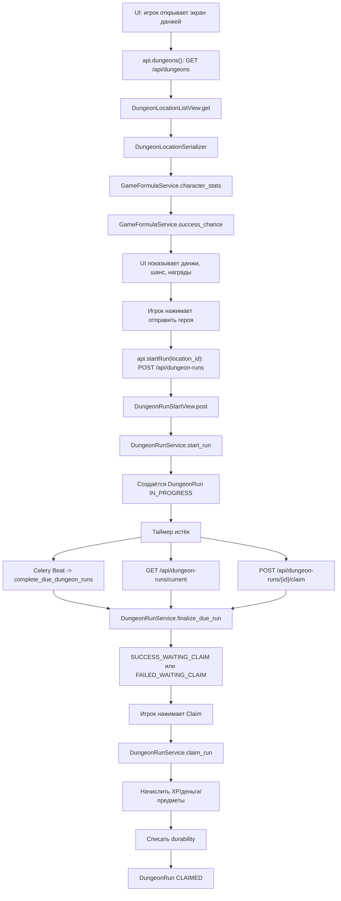
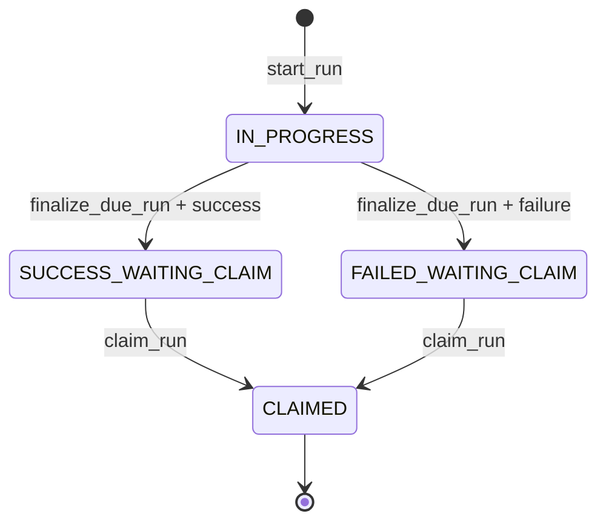
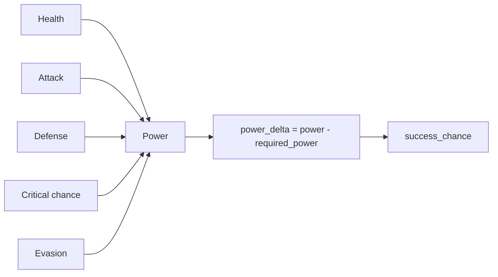
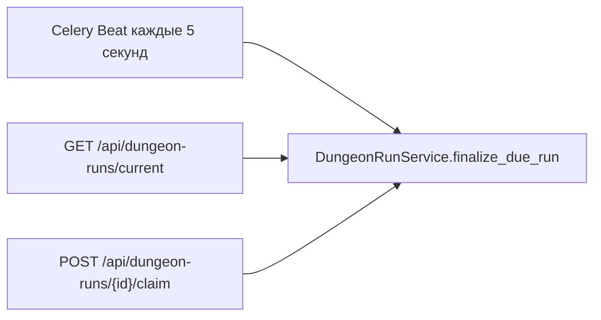
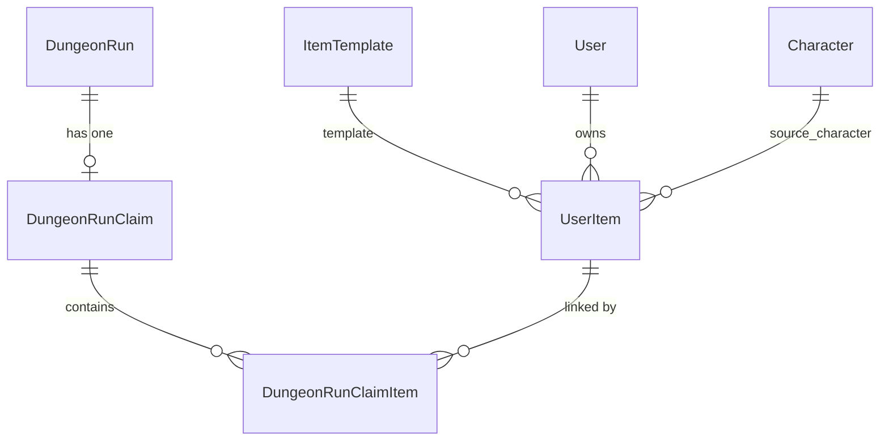
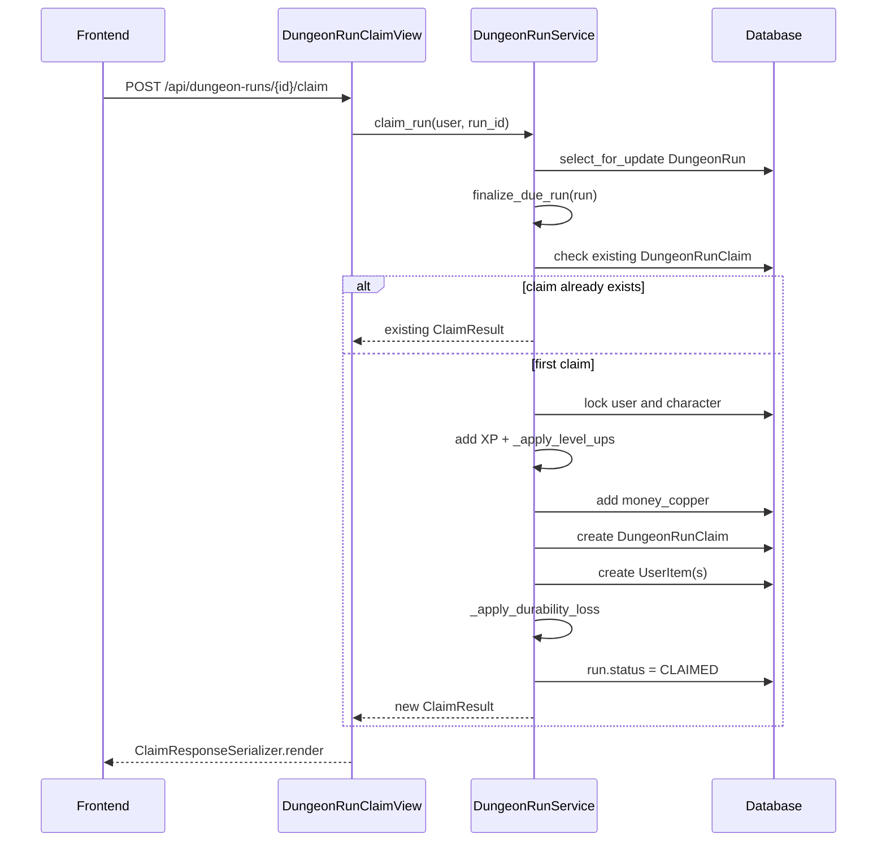

# Dungeon Run Flow

Документ описывает текущий серверный процесс прохождения данжа: от действий на
клиенте до API, сервисов, формул, завершения забега, генерации наград и claim.

Источник истины для расчётов и мутаций - код. Если этот документ расходится с
кодом, доверять нужно коду и обновить документ.

## Главные файлы

| Зона | Файл | Роль |
|---|---|---|
| Frontend API client | `frontend/lib/api.ts` | Вызывает `/api/dungeons`, `/api/dungeon-runs`, `/api/dungeon-runs/current`, `/claim`. |
| Frontend screen | `frontend/components/screens/dungeons-screen.tsx` | Показывает список данжей, активный забег, запускает start/claim мутации. |
| API routes | `backend/apps/game/urls.py` | Маппит HTTP endpoints на views. |
| Dungeon views | `backend/apps/game/views/dungeons.py` | Тонкий HTTP-слой: валидирует запрос, вызывает сервисы, отдаёт serializer response. |
| Dungeon serializers | `backend/apps/game/serializers/dungeons.py` | Формирует публичные payloads и preview-расчёты для UI. |
| Формулы и lifecycle | `backend/apps/game/services.py` | Основной слой: power, success chance, loot, start, finalize, claim, durability. |
| Модели данжей | `backend/apps/game/models/dungeons.py` | `DungeonLocation`, `DungeonRun`, `DungeonRunClaim`, статусы. |
| Celery task | `backend/apps/game/tasks.py` | Периодически завершает просроченные runs. |
| Celery schedule | `backend/config/settings.py` | Запускает `complete_due_dungeon_runs` каждые 5 секунд. |

## Короткая схема всего процесса



## API endpoints

| Endpoint | View | Что делает |
|---|---|---|
| `GET /api/dungeons` | `DungeonLocationListView.get` | Возвращает активные данжи. Для текущего героя считает `success_chance`. |
| `GET /api/dungeons/<id>` | `DungeonLocationDetailView.get` | Возвращает одну активную локацию. |
| `POST /api/dungeon-runs` | `DungeonRunStartView.post` | Валидирует `location_id`, вызывает `DungeonRunService.start_run`. |
| `GET /api/dungeon-runs/current` | `DungeonRunCurrentView.get` | Возвращает активный/готовый к claim run. Если таймер истёк, завершает run на лету. |
| `POST /api/dungeon-runs/<id>/claim` | `DungeonRunClaimView.post` | Идемпотентно начисляет награды и переводит run в `CLAIMED`. |
| `GET /api/dungeon-runs/history` | `DungeonRunHistoryView.get` | Возвращает историю завершённых забегов героя. |

## Статусы DungeonRun



| Статус | Значение |
|---|---|
| `IN_PROGRESS` | Герой в данже, таймер ещё идёт или run ещё не финализирован. |
| `SUCCESS_WAITING_CLAIM` | Таймер истёк, бросок успешный, награды уже зафиксированы в run, но ещё не выданы пользователю. |
| `FAILED_WAITING_CLAIM` | Таймер истёк, бросок провален, награды равны нулю, но claim всё равно нужен для закрытия run и списания durability. |
| `CLAIMED` | Claim выполнен, награды/прочность применены. |

## Откуда берутся данные данжа

Модель `DungeonLocation` хранит баланс конкретной локации:

| Поле | Откуда | На что влияет |
|---|---|---|
| `duration_seconds` | `DungeonLocation` | `ends_at = started_at + duration_seconds`. |
| `required_power` | `DungeonLocation` | Участвует в формуле `success_chance`. |
| `experience_min`, `experience_max` | `DungeonLocation` | Диапазон XP при успехе. |
| `money_min_copper`, `money_max_copper` | `DungeonLocation` | Диапазон валюты при успехе. |
| `item_drop_chance` | `DungeonLocation` | Первый бросок на выпадение предмета при успехе. |
| `DungeonLocationItemTemplate.chance` | join table | Какие `ItemTemplate` могут выпасть в этой локации и с каким весом. |
| `is_active` | `DungeonLocation` | Неактивные данжи нельзя получить в списке и запустить. |

## Откуда берётся power героя

Цепочка:

```text
DungeonLocationSerializer.get_success_chance
DungeonRunService.start_run
  -> GameFormulaService.character_stats(character)
      -> GameFormulaService.level_growth_stats(character)
      -> суммирование несломанной экипировки
      -> применение stat caps
      -> GameFormulaService.power_from_stats(stats)
```

Итоговые статы героя:

```text
base_stats из Character
+ level_growth из CharacterClass.growth_profile
+ stats от equipped_items, если item не broken
= итоговые stats
```

Сломанная экипировка остаётся в слоте, но пропускается в расчёте:

```python
if item.is_broken:
    continue
```

Капы по умолчанию:

| Стат | Max |
|---|---:|
| `critical_chance` | `60` |
| `evasion` | `50` |

Формула power по умолчанию:

```text
power =
  health * 0.25
  + attack * 2.0
  + defense * 1.7
  + critical_chance * 1.0
  + evasion * 1.0
```

Эти веса берутся из `GameConfigService.get_config("power_formula_config")`.
Сначала используются `DEFAULT_CONFIGS`, затем активная запись `GameConfig` в БД
может переопределить отдельные значения.

## Формула шанса успеха

Цепочка:

```text
GameFormulaService.success_chance(character_power, location.required_power)
```

Формула по умолчанию:

```text
raw = 75 + (character_power - required_power) * 1.5
success_chance = clamp(raw, 35, 100)
```

Где:

| Параметр | Default | Источник |
|---|---:|---|
| `base` | `75` | `success_chance_config` |
| `power_delta_multiplier` | `1.5` | `success_chance_config` |
| `min` | `35` | `success_chance_config` |
| `max` | `100` | `success_chance_config` |

Пример:

```text
character_power = 90
required_power = 100

raw = 75 + (90 - 100) * 1.5
raw = 75 - 15
raw = 60

success_chance = 60%
```

## Подробно: как характеристики влияют на мощь и шанс

В текущей реализации данж не смотрит напрямую на `attack`, `defense`, `health`,
`critical_chance` или `evasion`. Данж смотрит только на итоговый `power`.

То есть цепочка всегда такая:

```text
характеристики героя -> power -> разница с required_power -> success_chance
```

Схема:



### Вклад каждой характеристики в power

По дефолтной формуле каждый стат имеет свой вес:

| Характеристика | Вес в power | Что значит +1 к стату |
|---|---:|---|
| `attack` | `2.0` | `+1 attack` даёт `+2.0 power`. |
| `defense` | `1.7` | `+1 defense` даёт `+1.7 power`. |
| `health` | `0.25` | `+1 health` даёт `+0.25 power`. |
| `critical_chance` | `1.0` | `+1% crit` даёт `+1.0 power`. |
| `evasion` | `1.0` | `+1% evasion` даёт `+1.0 power`. |

Отсюда видно, что для расчёта мощи самый дорогой стат - `attack`, затем
`defense`, затем `critical_chance`/`evasion`, затем `health`.

Примеры равного вклада:

| Изменение | Прирост power |
|---|---:|
| `+1 attack` | `+2.0 power` |
| `+2 critical_chance` | `+2.0 power` |
| `+2 evasion` | `+2.0 power` |
| `+8 health` | `+2.0 power` |
| `+1 defense` | `+1.7 power` |

### Как power превращается в шанс

После расчёта power сервер считает разницу:

```text
power_delta = character_power - dungeon_required_power
```

Затем:

```text
raw_chance = 75 + power_delta * 1.5
success_chance = clamp(raw_chance, 35, 100)
```

Значит:

```text
+1 power относительно required_power = +1.5% к шансу
-1 power относительно required_power = -1.5% к шансу
```

Но шанс не может быть ниже `35%` и выше `100%`.

### Прямой перевод стата в шанс

Так как `1 power = 1.5% success chance`, можно посчитать влияние каждого стата
на шанс:

| Характеристика | +1 стат даёт power | +1 стат даёт шанс |
|---|---:|---:|
| `attack` | `+2.0` | `+3.0%` |
| `defense` | `+1.7` | `+2.55%` |
| `critical_chance` | `+1.0` | `+1.5%` |
| `evasion` | `+1.0` | `+1.5%` |
| `health` | `+0.25` | `+0.375%` |

Это работает только пока шанс не упёрся в clamp `35..100`. Если шанс уже
`100%`, новый stat всё ещё увеличит `power`, но шанс выше `100%` не станет.
Если герой сильно слабее данжа и шанс уже упал до `35%`, дальнейшая потеря
power шанс ниже `35%` не опустит.

### Пример расчёта power героя

Допустим, итоговые статы после уровня и экипировки:

```text
health = 120
attack = 15
defense = 8
critical_chance = 5
evasion = 3
```

Тогда:

```text
health contribution = 120 * 0.25 = 30.0
attack contribution = 15 * 2.0 = 30.0
defense contribution = 8 * 1.7 = 13.6
crit contribution = 5 * 1.0 = 5.0
evasion contribution = 3 * 1.0 = 3.0

power = 30.0 + 30.0 + 13.6 + 5.0 + 3.0
power = 81.6
```

Если этот герой идёт в данж с `required_power = 70`:

```text
power_delta = 81.6 - 70 = 11.6
raw_chance = 75 + 11.6 * 1.5 = 92.4
success_chance = 92.4%
```

Если тот же герой идёт в данж с `required_power = 100`:

```text
power_delta = 81.6 - 100 = -18.4
raw_chance = 75 + -18.4 * 1.5 = 47.4
success_chance = 47.4%
```

### Сколько power нужно для конкретного шанса

Формулу можно развернуть:

```text
target_chance = 75 + (power - required_power) * 1.5

power = required_power + (target_chance - 75) / 1.5
```

Для данжа `required_power = 100`:

| Целевой шанс | Нужный power | Комментарий |
|---|---:|---|
| `35%` | `73.34` или ниже | Ниже тоже будет `35%`, потому что min clamp. |
| `50%` | `83.34` | Герой слабее требования на `16.66 power`. |
| `75%` | `100.00` | Power ровно равен required power. |
| `90%` | `110.00` | Нужно `+10 power` сверх требования. |
| `100%` | `116.67` или выше | Выше тоже будет `100%`, потому что max clamp. |

Общее правило:

```text
75% шанс = power равен required_power
100% шанс = power примерно на 16.67 выше required_power
35% шанс = power примерно на 26.67 ниже required_power или ещё ниже
```

### Как предмет влияет на шанс

Допустим герой идёт в данж `required_power = 100`, а его текущий `power = 95`.

Без нового предмета:

```text
power_delta = 95 - 100 = -5
success_chance = 75 + -5 * 1.5 = 67.5%
```

Предмет даёт:

```json
{
  "attack": 3,
  "health": 12
}
```

Вклад предмета:

```text
attack: 3 * 2.0 = 6.0 power
health: 12 * 0.25 = 3.0 power
total = 9.0 power
```

Новый power:

```text
95 + 9 = 104
```

Новый шанс:

```text
power_delta = 104 - 100 = 4
success_chance = 75 + 4 * 1.5 = 81%
```

Итог: этот предмет поднял шанс с `67.5%` до `81%`, то есть на `13.5%`.

### Как уровень влияет на шанс

Level up сам по себе не прибавляет `power` напрямую. Он увеличивает статы через
`CharacterClass.growth_profile`, а уже статы увеличивают `power`.

Дефолтный прирост за уровень:

```text
+5 health
+1 attack
+1 defense
```

Вклад одного такого уровня в power:

```text
health: 5 * 0.25 = 1.25
attack: 1 * 2.0 = 2.0
defense: 1 * 1.7 = 1.7

total = 4.95 power
```

Вклад в шанс:

```text
4.95 power * 1.5 = 7.425%
```

То есть один обычный уровень по дефолтному growth примерно даёт `+4.95 power`
и `+7.43%` к шансу против того же самого данжа, пока шанс не упёрся в `100%`.

Если у класса есть special growth каждые 5 уровней, например:

```json
{
  "special_bonus_every": 5,
  "special_growth": {
    "critical_chance": 0.5,
    "evasion": 0
  }
}
```

то на 5/10/15/20 уровнях добавится ещё:

```text
critical_chance: 0.5 * 1.0 = 0.5 power
chance: 0.5 * 1.5 = 0.75%
```

### Как сломанная экипировка влияет на power и шанс

Сломанный предмет остаётся надетым, но его stats не участвуют в
`character_stats`.

Пример: герой имел `power = 110`, из них меч давал:

```text
attack +5 = 5 * 2.0 = 10 power
```

Если меч сломался:

```text
new_power = 110 - 10 = 100
```

Для данжа `required_power = 100`:

```text
до поломки: 75 + (110 - 100) * 1.5 = 90%
после поломки: 75 + (100 - 100) * 1.5 = 75%
```

Но есть ещё более важное правило: если на герое есть экипированный предмет с
`durability_current = 0`, новый данж вообще нельзя стартовать. Сначала предмет
нужно снять или починить.

### Практическая ценность характеристик

Если смотреть только на шанс прохождения данжа, ценность такая:

| Приоритет | Стат | Почему |
|---:|---|---|
| 1 | `attack` | Максимальный вклад: `+3%` шанса за `+1 attack`. |
| 2 | `defense` | Почти как attack: `+2.55%` шанса за `+1 defense`. |
| 3 | `critical_chance` | `+1.5%` шанса за `+1 crit`, но есть cap `60`. |
| 3 | `evasion` | `+1.5%` шанса за `+1 evasion`, но есть cap `50`. |
| 4 | `health` | Самый мягкий вклад: `+0.375%` шанса за `+1 health`. |

Это не означает, что `health` плохой стат для будущей боевой системы. Это
означает только то, что в текущей MVP-формуле данжей он слабее влияет именно на
`power` и `success_chance`.

## Запуск данжа

Frontend:

```text
DungeonsScreen
  -> startMutation
  -> api.startRun(location_id)
  -> POST /api/dungeon-runs
```

Backend:

```text
DungeonRunStartView.post
  -> DungeonRunStartSerializer(data=request.data)
  -> serializer.is_valid()
  -> DungeonRunService.start_run(user, location_id, locale)
  -> DungeonRunSerializer(run)
```

`DungeonRunService.start_run` делает:

1. Получает героя пользователя через `_get_character`.
2. Блокирует героя через `select_for_update`.
3. Проверяет, что нет другого `IN_PROGRESS` run.
4. Проверяет, что нет экипированных предметов с `durability_current = 0`.
5. Загружает активную `DungeonLocation`.
6. Считает `power`.
7. Считает `success_chance`.
8. Создаёт `DungeonRun`:

```text
character = character
location = location
status = IN_PROGRESS
started_at = now
ends_at = now + location.duration_seconds
success_chance = calculated_success_chance
```

Важная деталь: `success_chance` фиксируется в момент старта. Если потом игрок
поменяет экипировку, уже созданный run не пересчитает шанс.

## Завершение данжа

Есть три пути, которые могут вызвать финализацию:



`DungeonRunService.finalize_due_run(run, now=None)` сначала проверяет:

```text
если run.status != IN_PROGRESS -> ничего не делать
если run.ends_at > now -> ничего не делать
```

Если run готов:

1. Делает бросок успеха:

```text
is_success = random.uniform(0, 100) <= run.success_chance
```

2. Записывает:

```text
run.is_success = is_success
run.completed_at = now
run.status = SUCCESS_WAITING_CLAIM или FAILED_WAITING_CLAIM
```

3. Если успех:

```text
experience_reward = random.randint(location.experience_min, location.experience_max)
money_reward_copper = random.randint(location.money_min_copper, location.money_max_copper)
items_reward = [generated_item] или []
```

4. Если провал:

```text
experience_reward = 0
money_reward_copper = 0
items_reward = []
```

5. Считает будущую потерю прочности:

```text
durability_loss = GameFormulaService.durability_loss(is_success)
```

Важно: на этапе finalize награды только фиксируются в `DungeonRun`. Пользователь
ещё не получил деньги, опыт и предметы. Реальное начисление происходит в claim.

## Генерация предмета

Цепочка:

```text
DungeonRunService.finalize_due_run
  -> LootGenerationService.generate_item_reward(character, location)
      -> random.uniform(0, 100) vs location.item_drop_chance
      -> DungeonLocationItemTemplate.objects.filter(location=location).select_related("item_template")
      -> item_allowed_for_character(link.item_template, character)
      -> _weighted_choice(link.chance)
      -> selected ItemTemplate.rarity_key
      -> GameBalanceService.rarity_config(rarity)
      -> random item_level
      -> random selected stats
      -> final stat formula
```

Первый бросок:

```text
если random.uniform(0, 100) > location.item_drop_chance:
    предмет не выпал
```

Выбор шаблона и редкости:

```text
link = weighted_choice(location.location_item_templates, weight=chance)
template = link.item_template
rarity = template.rarity_key
```

Параметры редкостей по умолчанию:

| Rarity | Multiplier | Item level | Stats count |
|---|---:|---:|---:|
| `common` | `1.0` | `1-3` | `1` |
| `uncommon` | `1.25` | `2-5` | `1-2` |
| `rare` | `1.6` | `4-8` | `2-3` |
| `epic` | `2.2` | `7-10` | `3` |

Фильтр по классу:

| `item_type` | Класс |
|---|---|
| `sword` | `warrior` |
| `dagger` | `assassin` |
| `staff` | `mage` |
| `bow` | `archer` |

Если `ItemTemplate.allowed_classes` заполнен, герой тоже должен входить в этот
список.

Формула стата предмета:

```text
base_value = random.uniform(possible_stats[stat].min, possible_stats[stat].max)
value = base_value * rarity_multiplier * (1 + item_level * 0.08)
final_stat = max(1, round(value))
```

`generate_item_reward` возвращает только draft в JSON:

```text
{
  template_id,
  name,
  slot,
  item_type,
  rarity,
  item_level,
  stats,
  durability_current,
  durability_max
}
```

Реальный `UserItem` создаётся позже, только в `claim_run`.

## Подробно: выдача предмета пользователю

В текущей реализации есть два разных этапа:

1. `finalize_due_run` генерирует черновик предмета и сохраняет его в
   `DungeonRun.items_reward`.
2. `claim_run` создаёт настоящий `UserItem` в инвентаре пользователя.

Это важно: если данж завершился успешно и предмет выпал, до нажатия claim
предмет ещё не существует как запись `UserItem`. Он лежит только как JSON draft
в `DungeonRun.items_reward`.

Схема:

```mermaid
sequenceDiagram
    participant Finalize as finalize_due_run
    participant Loot as LootGenerationService
    participant Run as DungeonRun.items_reward
    participant Claim as claim_run
    participant UserItem as UserItem
    participant Link as DungeonRunClaimItem

    Finalize->>Loot: generate_item_reward(character, location)
    Loot-->>Finalize: item draft или None
    Finalize->>Run: save [item draft]
    Claim->>Run: read run.items_reward
    loop for each draft
        Claim->>UserItem: create UserItem from draft
        Claim->>Link: create DungeonRunClaimItem(claim, user_item)
    end
```

### Когда предмет вообще может появиться

Предмет может быть создан только если одновременно выполнены условия:

| Условие | Где проверяется |
|---|---|
| Забег завершился успехом | `DungeonRunService.finalize_due_run`: item generation вызывается только если `is_success`. |
| Бросок `item_drop_chance` прошёл | `LootGenerationService.generate_item_reward`. |
| У локации есть подходящие активные шаблоны | `ItemTemplate.objects.filter(is_active=True, template_locations__location=location)`. |
| Шаблон подходит классу героя | `item_allowed_for_character(template, character)`. |
| Пользователь нажал claim | `DungeonRunService.claim_run`. |

Если забег провален, генерация предмета не вызывается:

```text
item_reward = LootGenerationService.generate_item_reward(...) if is_success else None
```

Если бросок дропа не прошёл:

```text
if random.uniform(0, 100) > location.item_drop_chance:
    return None
```

Если подходящих шаблонов нет:

```text
if not templates:
    return None
```

### Этап 1: создание draft предмета при finalize

Функция:

```text
LootGenerationService.generate_item_reward(character, location)
```

Она возвращает либо `None`, либо словарь:

```text
{
  "template_id": template.id,
  "name": "<rarity name> <template.name>",
  "slot": template.slot,
  "item_type": template.item_type,
  "rarity": rarity,
  "item_level": item_level,
  "stats": stats,
  "durability_current": durability_max,
  "durability_max": durability_max
}
```

Этот словарь сохраняется в run:

```text
run.items_reward = [item_reward] if item_reward else []
```

Почему это draft, а не `UserItem`:

| Причина | Что даёт |
|---|---|
| Награда фиксируется при завершении таймера | Игрок видит стабильный `result_preview` до claim. |
| Реальная выдача отложена до claim | Деньги, XP, предметы и durability применяются одной транзакцией. |
| Claim идемпотентный | Повторный claim не создаст второй такой же предмет. |

### Этап 2: создание настоящего UserItem при claim

Функция:

```text
DungeonRunService.claim_run(user, run_id, locale)
```

Внутри claim:

```text
created_items = []
for draft in run.items_reward or []:
    item = UserItem.objects.create(...)
    DungeonRunClaimItem.objects.create(claim=claim, user_item=item)
    created_items.append(item)
```

Поля переносятся так:

| Draft field | UserItem field | Комментарий |
|---|---|---|
| `template_id` | `template_id` | Связь с исходным `ItemTemplate`. |
| `name` | `name` | Уже содержит имя редкости + имя шаблона. |
| `slot` | `slot` | Например `weapon`, `helmet`, `armor`, `boots`, `ring`. |
| `item_type` | `item_type` | Например `sword`, `staff`, `ring`. |
| `rarity` | `rarity` | `common`, `uncommon`, `rare`, `epic`. |
| `item_level` | `item_level` | Случайный уровень в диапазоне редкости. |
| `stats` | `stats` | Уже рассчитанные финальные статы. |
| `durability_current` | `durability_current` | Новый предмет создаётся с полной прочностью. |
| `durability_max` | `durability_max` | Случайное значение из диапазона шаблона. |

Поля, которых нет в draft, выставляются отдельно:

| UserItem field | Значение |
|---|---|
| `owner_user` | Текущий пользователь, который claim-ит награду. |
| `source_character` | Герой, который прошёл данж. |
| `equipped_character` | `null`, предмет появляется в инвентаре, не надевается автоматически. |

### Связь claim -> item

После создания `UserItem` создаётся связующая запись:

```text
DungeonRunClaimItem.objects.create(claim=claim, user_item=item)
```

Она нужна, чтобы понимать, какой предмет был получен конкретным claim.

Модельная связь:



### Почему повторный claim не дублирует предмет

Перед созданием `UserItem` сервис проверяет существующий claim:

```text
existing_claim = getattr(run, "claim", None)
if existing_claim:
    return existing result
```

Так как `DungeonRunClaim.dungeon_run` - `OneToOneField`, у одного run может быть
только один claim. Если игрок или клиент повторно отправит `POST /claim`, код не
пойдёт второй раз по `run.items_reward` и не создаст второй `UserItem`.

### Что возвращается клиенту после claim

`ClaimResponseSerializer.render` возвращает не весь предмет, а краткий список:

```text
"items": [
  {
    "id": item.id,
    "name": localized_item_name(item, locale),
    "rarity": item.rarity,
    "item_level": item.item_level
  }
]
```

Полные stats, durability и остальные детали предмета клиент получает уже через
inventory endpoints.

### Важная особенность текущего MVP

Сейчас `generate_item_reward` создаёт максимум один предмет за run:

```text
run.items_reward = [item_reward] if item_reward else []
```

Но `claim_run` написан как цикл по `run.items_reward`, поэтому технически он уже
готов обработать несколько draft-предметов, если будущий баланс начнёт класть в
`items_reward` больше одного элемента.

## Claim награды

Frontend:

```text
ActiveRunBanner
  -> api.claimRun(run.id)
  -> POST /api/dungeon-runs/{id}/claim
```

Backend:

```text
DungeonRunClaimView.post
  -> DungeonRunService.claim_run(user, run_id, locale)
  -> ClaimResponseSerializer.render(result)
```

`DungeonRunService.claim_run` делает:

1. Блокирует `DungeonRun` через `select_for_update`.
2. Проверяет, что run принадлежит пользователю.
3. Вызывает `finalize_due_run(run)`, чтобы claim мог завершить просроченный run.
4. Проверяет существующий `run.claim`.
5. Если claim уже есть, возвращает существующий результат без повторного
   начисления наград.
6. Проверяет, что статус `SUCCESS_WAITING_CLAIM` или `FAILED_WAITING_CLAIM`.
7. Блокирует `user` и `character`.
8. Добавляет опыт герою.
9. Применяет level ups.
10. Добавляет деньги пользователю.
11. Создаёт `DungeonRunClaim`.
12. Создаёт реальные `UserItem` из `run.items_reward`.
13. Списывает durability с экипировки.
14. Переводит run в `CLAIMED`.

Схема claim:



## Опыт и уровни

При claim:

```text
character.experience += run.experience_reward
DungeonRunService._apply_level_ups(character)
```

Формула опыта до следующего уровня:

```text
experience_required = ceil(base * level ^ exponent)
```

Default:

```text
base = 100
exponent = 1.5
max_level = 20
```

Level up loop:

```text
while character.level < max_level:
    required = experience_required(character.level)
    if character.experience < required:
        break
    character.experience -= required
    character.level += 1
```

Статы от уровня не записываются в `Character.base_*`. Они считаются динамически в
`GameFormulaService.level_growth_stats` из `CharacterClass.growth_profile`.

Default growth, если профиль не переопределяет:

```text
health_per_level = 5
attack_per_level = 1
defense_per_level = 1
special_bonus_every = 5
```

## Прочность экипировки

Потеря прочности берётся из:

```text
GameFormulaService.durability_loss(is_success)
```

Default:

| Результат | Потеря |
|---|---:|
| Успех | `1` |
| Провал | `5` |

Списание происходит в claim:

```text
DungeonRunService._apply_durability_loss(character, run.durability_loss)
```

Логика:

```text
для каждого equipped item героя:
    durability_current = max(0, durability_current - loss)
```

Если предмет стал сломанным:

| Правило | Где проявляется |
|---|---|
| Не даёт stats | `GameFormulaService.character_stats` пропускает `item.is_broken`. |
| Блокирует новый данж | `DungeonRunService.start_run` проверяет `durability_current=0`. |
| Нельзя надеть заново | `InventoryService.can_equip` и `InventoryService.equip` отклоняют broken item. |
| Можно снять | `InventoryService.unequip` не запрещает broken item. |

## Где именно считаются preview для UI

`GET /api/dungeons` и `GET /api/dungeons/<id>` возвращают данные через
`DungeonLocationSerializer`.

Serializer добавляет:

| Поле | Как считается |
|---|---|
| `success_chance` | `GameFormulaService.character_stats` -> `GameFormulaService.success_chance`. |
| `rewards_preview.experience` | `experience_min/max` из `DungeonLocation`. |
| `rewards_preview.money_copper` | `money_min/max` из `DungeonLocation`. |
| `media` | `media_payload(obj.media, context)`. |

Клиент не считает игровые формулы. Он только показывает то, что пришло с API.

## Что влияет на результат

| Что меняем | На что влияет |
|---|---|
| `Character.base_*` | Итоговые stats и power. |
| `Character.level` | Level growth, итоговые stats и power. |
| `CharacterClass.growth_profile` | Прирост stats по уровням. |
| Экипировка | Итоговые stats и power, если предмет не сломан. |
| `GameConfig.power_formula_config` | Вес каждого стата в power. |
| `DungeonLocation.required_power` | Success chance. |
| `GameConfig.success_chance_config` | База, множитель разницы power, min/max шанс. |
| `DungeonLocation.duration_seconds` | Длительность run. |
| `DungeonLocation.experience_min/max` | Диапазон XP при успехе. |
| `DungeonLocation.money_min/max` | Диапазон денег при успехе. |
| `DungeonLocation.item_drop_chance` | Вероятность предмета при успехе. |
| `DungeonLocationItemTemplate.chance` | Какие шаблоны предметов могут выпасть и их вес внутри локации. |
| `RarityConfig` | Множитель статов, item level range, stats count. |
| `ItemTemplate.possible_stats` | Какие статы и диапазоны может получить предмет. |
| `ItemTemplate.min/max_durability` | Максимальная прочность нового предмета. |
| `GameConfig.durability_loss_config` | Потеря прочности при успехе/провале. |
| `GameConfig.experience_curve_config` | Требуемый опыт и max level. |

## Что не влияет на уже запущенный run

После `start_run` в `DungeonRun` уже сохранены:

```text
location
started_at
ends_at
success_chance
```

Поэтому на уже созданный run не влияет:

| Изменение после старта | Почему |
|---|---|
| Смена экипировки | `success_chance` уже сохранён. |
| Level up до завершения | `success_chance` уже сохранён. |
| Изменение `required_power` у локации | Run хранит старый рассчитанный шанс. |
| Изменение формулы power/chance | Run хранит старый рассчитанный шанс. |

Но на награды при финализации влияют текущие данные `DungeonLocation`, потому
что `experience_min/max`, `money_min/max`, `item_drop_chance`,
и `DungeonLocationItemTemplate.chance` читаются в момент `finalize_due_run`.

## Идемпотентность claim

`DungeonRunClaim` связан с `DungeonRun` через `OneToOneField`. Поэтому у run
может быть только один claim.

`claim_run` сначала проверяет:

```text
existing_claim = getattr(run, "claim", None)
```

Если claim уже есть, сервис возвращает существующий результат и не начисляет
деньги, опыт, предметы и durability loss повторно.

## Настройки через GameConfig

`GameConfigService.get_config(key)` работает так:

```text
value = DEFAULT_CONFIGS[key].copy()
db_config = active GameConfig by key
if db_config.value is dict:
    value.update(db_config.value)
return value
```

То есть БД может частично переопределить дефолтный конфиг, не дублируя весь
словарь.

Поддерживаемые ключи в текущем коде:

| Key | Что контролирует |
|---|---|
| `power_formula_config` | Веса stats в power. |
| `success_chance_config` | Формула success chance и clamp. |
| `repair_cost_config` | Стоимость ремонта. |
| `experience_curve_config` | Кривая опыта и max level. |
| `stat_caps` | Максимумы `critical_chance` и `evasion`. |
| `durability_loss_config` | Потеря прочности при успехе/провале. |

## Мини-псевдокод end-to-end

```text
player opens dungeon screen
api.dungeons()
server returns active locations + success_chance preview

player starts dungeon
api.startRun(location_id)
server:
    character = lock current character
    assert no active run
    assert no broken equipped items
    location = active DungeonLocation
    power = character_stats(character).power
    chance = success_chance(power, location.required_power)
    create DungeonRun(IN_PROGRESS, ends_at, chance)

time passes
server finalizes due run:
    if now < ends_at: stop
    success = random(0, 100) <= run.success_chance
    if success:
        reward XP/money from location ranges
        maybe generate item reward draft
    else:
        reward XP/money/items = 0/empty
    save waiting-claim status and durability_loss

player claims
server:
    lock run
    finalize if still due and not finalized
    if claim exists: return existing claim
    lock user and character
    add XP
    apply level ups
    add money
    create claim
    create UserItem from item drafts
    reduce durability on equipped items
    set run CLAIMED
    return rewards + level_up info
```
